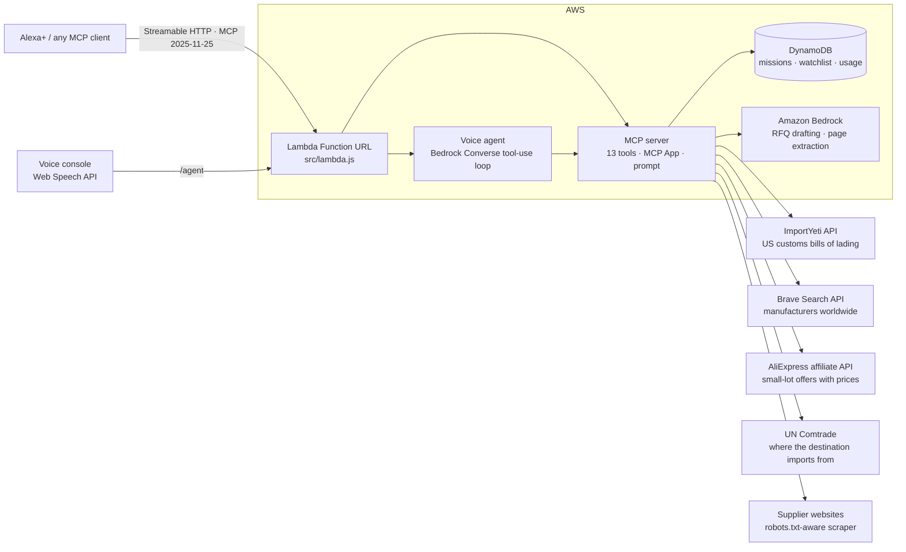

# ManaLog — voice sourcing agent for island makers (Alexa+ · MCP · AWS)

> *"Alexa, ask ManaLog to find me 2,000 glass bottles for my monoï."*
> → proven exporters from real customs data, scored, landed cost in XPF to Tahiti, and a quote request drafted — waiting for your approval.

**ManaLog** is a self-hosted **MCP server** (spec **2025-11-25**, Streamable HTTP) that gives Alexa+ an **agentic import/export workflow**. It runs on **AWS Lambda + DynamoDB + Amazon Bedrock**, and ships with a browser **voice console** that simulates the Alexa+ experience end-to-end.

It was built for the artisans of French Polynesia 🇵🇫: people who make world-class monoï, vanilla and pearl jewelry, but who buy bottles, packaging and raw materials across 6,000 km of ocean with no purchasing department. It works the same way for any small importer or exporter.

| Track | Mini-challenges |
|---|---|
| **Alexa+** (self-hosted MCP server + simulated Alexa+ console) | **AWS Builder** (Lambda, DynamoDB, Bedrock) · **Open Source** (AGPL-3.0) |

---

## What it does

| Voice request | What ManaLog does (tool) |
|---|---|
| "Find me 2,000 glass bottles for my monoï" | **`start_sourcing_mission`**, agentic: customs data → enrich → score → landed cost → budget filter → shortlist of 3 → RFQ email draft → saved |
| "Compare them" / "What did you find last time?" | `get_mission`: state persists across sessions and devices (DynamoDB) |
| "Send it" | `approve_rfq`: **human-in-the-loop**. Returns a one-tap email; ManaLog never contacts a supplier without approval |
| "Who buys vanilla in the US?" | `find_buyers`: **export** prospecting from US import records |
| "What does it cost landed in Tahiti?" | `estimate_landed_cost`: goods + freight + insurance → CIF → stacked duties/taxes (VAT compounding) + brokerage, in USD and XPF |
| "Read this supplier's website" | `scrape_supplier_site`: one page, robots.txt respected, SSRF-hardened, Bedrock extracts a supplier card |
| "Watch this supplier" / "What's new?" | `watch_supplier`, `check_watchlist`: diffs new shipments since your last check |
| "Search shipments of 'coconut oil' NOT 'refined'" | `search_shipments`: raw bills of lading (PowerQuery syntax) |
| "What's my plan?" | `my_account`: plan, usage, brand, destinations |

Plus an **MCP App** (`ui://manalog/mission-card.html`, `text/html;profile=mcp-app`) that renders the shortlist card on screen devices, a `sourcing_brief` **prompt**, and a `manalog://destinations` **resource**.

Every answer is **voice-first** (1 to 3 short sentences) with **structured content** for cards. Every supplier score is **explainable out loud** ("84 shipments in 12 months, +25; nearby to Tahiti, +20…").

## Architecture



**Data sources, cheapest and most proven first** (`src/core/discovery.js`): the request is first planned into precise English terms and HS codes (`src/core/terms.js`, Bedrock or a built-in dictionary). US customs data comes first; extra terms are queried only when results are thin (each query costs credits). Web search runs only when customs data is thin, AliExpress adds priced small-lot offers, and UN Comtrade adds a scoring bonus for countries that really supply the destination. Each extra source is skipped when its key is empty (`-BraveKey`, `-AliKey`/`-AliSecret`, optional `-ComtradeKey` in `scripts/deploy.ps1`; Comtrade's free preview needs no key), and demo mode never calls any of them.

- **One tool registry** (`src/mcp/tools.js`) serves both the MCP server (Alexa+) and the Bedrock voice agent, so what you see in the console is exactly what Alexa+ calls.
- **Stateless transport, stateful product.** A fresh MCP server per request (Lambda-friendly, JSON responses), while user state (missions, watchlist, usage) lives in DynamoDB, keyed by `tenant + user`.
- **Pacific customs check.** Fiji destination (FJD) and a `check_customs_documents` tool built on [pacific-customs-kit](https://github.com/Heya-56/pacific-customs-kit) (MIT): invoice and bill-of-lading checks, official FRCS VAT formula, alerts on discrepancies.
- **Offline-first demo.** With no API keys, ManaLog runs on bundled fictional demo data and a deterministic intent router, so judges can test it in 30 seconds.

## Quick start (local, no keys needed)

```bash
git clone https://github.com/Heya-56/manalog && cd manalog
npm install
npm start                 # → http://localhost:8787 (voice console) · http://localhost:8787/mcp (MCP)
npm test                  # 11 unit/integration tests
npm run e2e               # official MCP SDK client ↔ server over Streamable HTTP
```

Open http://localhost:8787, click a suggestion chip or the mic (Chrome/Edge), and try the demo script:
1. *Find me 2000 glass bottles for my monoi*
2. *Compare the suppliers*
3. *Send it*
4. *Who buys vanilla in the US?*
5. *Trouve-moi 1500 flacons pour mon monoï* (French works too)

**Judges' API key:** given privately in the Devpost testing instructions (Pro plan, free until judging ends). Without a key the hosted console runs on the free Community plan with demo data.

## Deploy to AWS (≈5 minutes)

Prerequisites: AWS account, [AWS SAM CLI](https://docs.aws.amazon.com/serverless-application-model/latest/developerguide/install-sam-cli.html), and Bedrock **model access** enabled for your chosen Claude model in your region (default `us-west-2`).

```bash
cd infra
sam build -t template.yaml
sam deploy --guided        # set BedrockEnabled=true; ImportYetiApiKey optional (empty = demo data)
```

Outputs:
- `ConsoleUrl`: voice console
- `McpEndpoint`: register this in Alexa+ (or Claude, Cursor, MCP Inspector) as a Streamable HTTP MCP server, with header `x-api-key: <your key>` (or `?key=` in the URL)

Environment variables are documented in `src/core/config.js`.

## Connect an MCP client

```json
{ "mcpServers": { "manalog": { "type": "http", "url": "https://<your-function-url>/mcp", "headers": { "x-api-key": "<your-api-key>", "x-manalog-user": "me" } } } }
```

Or inspect it: `npx @modelcontextprotocol/inspector` → Transport *Streamable HTTP* → URL above.

## AWS services used

| Service | How |
|---|---|
| **AWS Lambda** (Node 22, arm64, Function URL) | Hosts the MCP Streamable HTTP endpoint, the voice agent and the console. Web-standard `Request/Response` adapter in `src/lambda.js` |
| **Amazon Bedrock** (Converse API, Claude) | (1) Agent loop: the voice console's LLM plans and calls ManaLog tools via Bedrock tool use (`src/agent/agent.js`); (2) RFQ email drafting in EN/FR; (3) turning scraped supplier pages into structured supplier cards |
| **Amazon DynamoDB** (on-demand, single table) | Missions, watchlists and per-tenant monthly usage metering (`src/core/store.js`) |
| **AWS SAM / CloudFormation** | One-command infrastructure (`infra/template.yaml`) with least-privilege IAM |

## Business model: open core + white-label

ManaLog is **open source under AGPL-3.0**: anyone can self-host it with every feature unlocked. The hosted service and resellers run with `MANALOG_ENFORCE_PLANS=true`:

| Plan | For | Includes |
|---|---|---|
| **Community** (free) | Individual makers | Supplier & buyer search, landed cost, watchlist, 50 calls/month |
| **Pro** | Small import/export businesses | + agentic missions, RFQ drafting, website reading, live customs data, 2,000 calls/month |
| **White-label** | Chambers of commerce, co-ops, logistics hubs, customs brokers | + own brand, voice persona and colors, **own verified duty/tax rates**, 20,000 calls/month |

Companies that want to embed ManaLog **without AGPL obligations** can buy a commercial license. See [COMMERCIAL.md](COMMERCIAL.md) and [docs/WHITE_LABEL.md](docs/WHITE_LABEL.md).

## Responsible design

- **Human-in-the-loop:** nothing is sent to a supplier without explicit approval.
- **Honest numbers:** duty/tax rates are illustrative defaults marked `verified:false`, and every estimate says so. White-label tenants plug in broker-verified rates.
- **Polite scraping:** one page per request, robots.txt honored, identified User-Agent.
- **Security:** SSRF guard (private, loopback and metadata ranges blocked; redirects re-validated), body-size limits, per-tenant data isolation. See [docs/SECURITY.md](docs/SECURITY.md).
- **Demo data is fictional:** every company in `data/fixtures.js` is marked "(demo)".

## Repository map

```
src/lambda.js            AWS Lambda entry (Function URL → web Request)
src/local.js             Local Node server
src/http.js              Router: /mcp, /agent, /, /health
src/mcp/server.js        MCP server factory, plan guard + metering, MCP App resource, prompt
src/mcp/tools.js         The 13 tools (shared by MCP + voice agent)
src/agent/agent.js       Bedrock tool-use loop + offline intent router
src/core/*               Trade data, scoring, landed cost, missions, watchlist, scraper, tenants, store
data/                    Demo fixtures + duty/freight profiles
public/                  Voice console + MCP App card
infra/template.yaml      AWS SAM stack
test/                    node:test suite + MCP SDK e2e client
```

## License

AGPL-3.0-only © 2026 Heianui Tapare, Hinova Digital (Ploemeur, France / Tahiti). Commercial licenses are available.
